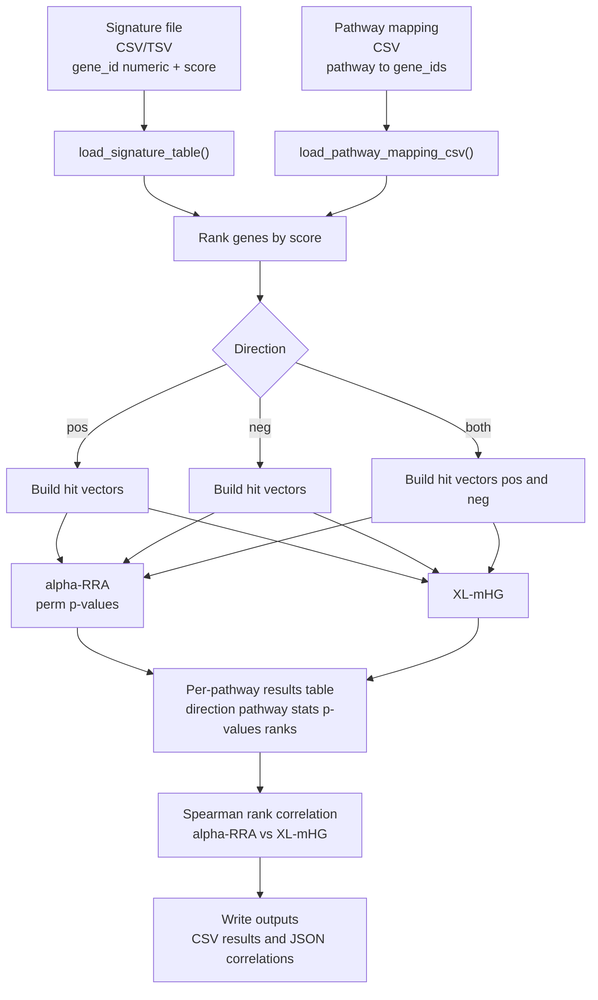

# CLUE Pathway Enrichment (skeleton / reference implementation)

This repository contains a small Python package, `clue_pathway_enrichment`, that runs a simple **pathway enrichment** analysis on a CLUE-style gene signature.

At a high level it:

1. Loads a **signature** table: gene IDs + a numeric score.
2. Splits it into **positive** and **negative** directions (or both).
3. For each pathway gene set, builds a **binary hit vector** over the ranked genes.
4. Runs two enrichment-style methods:
   - **alpha-RRA** (permutation p-value)
   - **XL-mHG**
5. Ranks pathways by p-value and reports rank correlations.

The code is intentionally lightweight and meant as a starting point you can extend.

---

## Visual pipeline (overview)



---

## Project layout

- `config.json`: editable run configuration (committed to the repo)
- `src/clue_pathway_enrichment/`: package code
  - `io/`: reading signature/pathway files
  - `preprocessing/`: ranking / splitting / hit vectors
  - `methods/`: alpha-RRA and XL-mHG wrappers
  - `analysis/`: ranking utilities and correlations
  - `pipeline/`: orchestration (`run_pipeline.py`), config/CLI
- `tests/`: small unit/integration tests

---

## Quick start (no install)

From the repo root:

```bash
PYTHONPATH=$PWD/src python3 -m clue_pathway_enrichment.pipeline.cli --config config.json
```

This runs the pipeline using the parameters in your config and writes outputs if `output_*` paths are set.

If you install the package (e.g. `python -m pip install -e .`), you also get a console script:

```bash
clue-pathway-enrichment --config config.json
```

---

## Configuration (`config.json`)

A project-level config is included at the repo root and is meant to be edited.

### Supported formats

- **JSON** is preferred.
- **TOML** is supported as a backward-compatible fallback.

Config selection rules used by `load_pipeline_config()`:
- `*.json` => JSON
- `*.toml` => TOML
- otherwise: it tries JSON first, then TOML

### Example (JSON)

```json
{
  "pipeline": {
    "signature_path": "data/signature.tsv",
    "pathway_csv": "data/pathways.csv",

    "direction": "both",
    "alpha": 0.2,
    "n_perm": 200,
    "seed": 0,
    "X": 1,
    "L": 100,

    "output_csv": "out/results.csv",
    "output_spearman_json": "out/spearman.json"
  }
}
```

### Example (TOML)

```toml
[pipeline]
signature_path = "data/signature.tsv"
pathway_csv = "data/pathways.csv"

direction = "both"
alpha = 0.2
n_perm = 200
seed = 0
X = 1
L = 100

output_csv = "out/results.csv"
output_spearman_json = "out/spearman.json"
```

### Fields

All fields live under the top-level key `pipeline`.

#### Inputs

- `signature_path` (string, **required**)
  Path to your signature file (CSV or TSV).

- `pathway_csv` (string, **required**)
  Path to your pathway mapping file (CSV).

> Note on relative paths: they’re interpreted relative to the **current working directory** when you run the command.

#### Run parameters

- `direction` (string, default: `"both"`)
  One of: `"pos"`, `"neg"`, `"both"`.

- `alpha` (float, default: `0.2`)
  alpha-RRA parameter. Must be in `(0, 1)`.

- `n_perm` (int, default: `200`)
  Number of permutations for alpha-RRA p-value estimation. Use `0` for a fast “no permutations” run (if your wrapper supports it).

- `seed` (int or null, default: `0`)
  Random seed for alpha-RRA permutations. Use `null` for non-deterministic.

- `X` (int, default: `1`)
  XL-mHG parameter.

- `L` (int, default: `100`)
  XL-mHG parameter.

#### Outputs

- `output_csv` (string or null)
  If set, the CLI writes the main results table to CSV.

- `output_spearman_json` (string or null)
  If set, the CLI writes a small JSON object with Spearman correlations between the two ranking methods.

### Validation behavior

The config loader (`pipeline/config.py`) validates:
- `direction` is one of `pos|neg|both`
- numeric bounds for `alpha`, `n_perm`, `X`, `L`
- **input files exist** at the given paths

---

## Input file formats

> Important: the pipeline supports gene **names** (symbols) as well as **numeric gene IDs**.  
> The key requirement is **consistency**: the identifier format in `signature_path` must match the identifier format used in `pathway_csv` (both long format and summary lists).  
> Example: if your signature uses numeric IDs (e.g., `2547`), the pathway members must also be numeric IDs (e.g., `[2547, 3159, ...]`).

### Signature file (`signature_path`)

Loaded by `clue_pathway_enrichment.io.load_signature.load_signature_table`.

Supported formats:

1) **Standard**: must include columns named `gene` and `score` (case-insensitive)

Example TSV (numeric IDs):

```tsv
gene	score
2547	1.2
1956	-0.7
```

2) **CLUE-style**: must include column `gene_id` and exactly one other score column, e.g.:

```tsv
gene_id	my_signature
2547	1.2
1956	-0.7
```

If there’s more than one score column, you must extend the loader or pass a score column (the current pipeline doesn’t thread that option through yet).

The loader:
- trims gene strings
- coerces score to numeric
- drops rows with missing/invalid gene or score

### Pathway mapping file (`pathway_csv`)

Loaded by `clue_pathway_enrichment.io.load_pathways.load_pathway_mapping_csv`.

Supported formats:

1) **Long format**: columns `pathway` and `gene` (one row per member gene)

```csv
pathway,gene
Apoptosis,2547
Apoptosis,836
MAPK,1956
```

2) **Summary format**: columns `pathway` and one of `genes` or `gene_ids`.
That genes column can be a JSON/Python-like list string or a delimited string.

Example (numeric IDs):

```csv
pathway,gene_ids
2-LTR Circle Formation R-HSA-164843,"[2547, 3159, 3981, 7518, 7520, 8815, 11168]"
MAPK,"1956,3845,673"
```

---

## Running

### CLI

The CLI is implemented in `src/clue_pathway_enrichment/pipeline/cli.py`.

Run without installing:

```bash
PYTHONPATH=$PWD/src python3 -m clue_pathway_enrichment.pipeline.cli --config config.json
```

Run after installing (console script from `pyproject.toml`):

```bash
clue-pathway-enrichment --config config.json
```

Optional overrides (override whatever is in the config):

```bash
PYTHONPATH=$PWD/src python3 -m clue_pathway_enrichment.pipeline.cli \
  --config config.json \
  --direction pos \
  --alpha 0.1 \
  --n-perm 500 \
  --seed 123 \
  --X 1 \
  --L 200 \
  --output-csv out/custom.csv \
  --output-spearman-json out/custom_spearman.json
```

### Python API

The main entry points live in `pipeline/run_pipeline.py`.

```python
from clue_pathway_enrichment.pipeline.run_pipeline import run

results_df, spearman = run(
    signature_path="data/signature.tsv",
    pathway_csv="data/pathways.csv",
    direction="both",
    alpha=0.2,
    n_perm=200,
    seed=0,
    X=1,
    L=100,
)
```

Or using the config helper:

```python
from clue_pathway_enrichment.pipeline.run_pipeline import run_from_config

results_df, spearman = run_from_config("config.json")
```

---

## Output

### Results table (`output_csv`)

The pipeline returns a pandas `DataFrame` (and optionally writes it to CSV) with one row per tested `(direction, pathway)`.

Notes:
- Ranking is computed **within each direction separately**.
- If a direction has no ranked genes, it’s skipped.
- If a pathway has `K_hits == 0` (no overlap with the ranked list), it’s skipped.

Columns include:
- `direction`: `pos` or `neg`
- `pathway`: pathway name
- `K_hits`: number of hits for that pathway in the ranked list
- `N`: ranked list size
- `alpha_rra_stat`, `alpha_rra_p`
- `xlmhg_stat`, `xlmhg_p`
- `rank_alpha_rra`: rank of `alpha_rra_p` (lower p-value = better rank)
- `rank_xlmhg`: rank of `xlmhg_p`

### Spearman correlations (`output_spearman_json`)

A small dict: `{ "pos": <rho>, "neg": <rho> }` for directions that were run.

---

## Testing

If you can install dependencies in your environment:

```bash
python -m pip install -r requirements.txt
python -m pytest -q
```

If you *can’t* do editable installs, you can still run tests by pointing `PYTHONPATH` at `src`:

```bash
PYTHONPATH=$PWD/src python -m pytest -q
```

---

## Troubleshooting

### Import errors (package not found)

If you see `ModuleNotFoundError: clue_pathway_enrichment`, run with:

```bash
PYTHONPATH=$PWD/src ...
```

or install in editable mode:

```bash
python -m pip install -e .
```

### Config says files don’t exist

`load_pipeline_config()` checks that `signature_path` and `pathway_csv` exist.
Double-check:
- paths in your config
- your working directory (relative paths are resolved from where you run the command)

---

## Notes / next steps

This repo is a starting point. Common extensions:
- Add support for selecting the CLUE signature score column in the config.
- Add multiple-testing correction (FDR/q-values).
- Add richer outputs (top-N per direction, plots, etc.).
