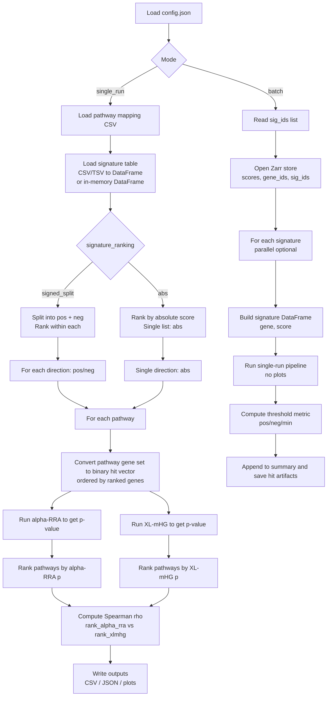

# CLUE Pathway Enrichment

Run pathway enrichment on CLUE-like gene signatures using **two ranking-based enrichment tests**:

- **alpha-RRA** (robust rank aggregation style test)
- **XL-mHG** (XL-minimum-hypergeometric test)

The pipeline ranks pathways by p-value for each test and reports a **Spearman rank correlation (ρ)** between the two rankings, plus optional rank-agreement scatter plots.

This repo supports:

- **Single-run mode**: analyze one signature (CSV/TSV or an in-memory DataFrame if you call `run()` from Python).
- **Batch mode**: scan many signatures stored in a **Zarr** matrix and flag signatures whose rank-agreement (Spearman ρ) is below a threshold.

---

## Quick start

### 1) Install dependencies

Option A — install in editable mode (recommended for dev):

```bash
python -m pip install -r requirements.txt
python -m pip install -e .
```

Option B — run without installing the package (useful in a cloned repo):

```bash
python -m pip install -r requirements.txt
PYTHONPATH=$PWD/src python -m clue_pathway_enrichment.pipeline.cli --config config.json
```

> Notes
> - Plotting requires `matplotlib` (optional; only needed if you ask for plot outputs).
> - XL-mHG requires the `xlmhg` Python package. Make sure it’s installed in your environment.

---

## How it works flowchart



---

## Inputs

### Pathway mapping (`pipeline.pathway_csv`)

Supported pathway mapping formats (CSV):

1) **Long format** (one row per gene):

- `pathway` column
- `gene` column

2) **Summary format** (one row per pathway):

- `pathway` column
- and one of: `genes` or `gene_ids`
  - This cell can be a python-list-like string (`"['1','2']"`), a comma/semicolon/space-separated string (`"1,2,3"`), or an actual list.

All gene identifiers are normalized to **strings** internally.

### Signature table (single run)

Supported signature formats:

- **Standard**: columns `gene` and `score` (case-insensitive)
- **CLUE-style**: columns `gene_id` and exactly one score column (or specify which score column in Python)

The loader coerces:

- `gene` to string (
  so numeric IDs like `1234` become `"1234"`
  )
- `score` to numeric (`to_numeric(errors='coerce')`)
- drops rows with missing gene or invalid score

So yes: **integer/numeric gene IDs are supported** as long as pathway genes and signature genes match after string conversion.

### Signature store (batch run)

Batch expects a Zarr group at `batch.signature_store.path` with datasets:

- `scores`: shape `(n_genes, n_signatures)`
- `gene_ids`: len `n_genes`
- `sig_ids`: len `n_signatures`

`gene_ids` and `sig_ids` can be bytes or strings; they’re converted to strings internally.

---

## Modes

### 1) Single-run mode

Runs the pipeline for one signature and produces a per-pathway result table.

What you get:

- a results DataFrame with columns like:
  - `direction` ("pos", "neg", or "abs")
  - `pathway`
  - `alpha_rra_p`, `xlmhg_p`
  - `rank_alpha_rra`, `rank_xlmhg`
- a Spearman correlation structure per direction:
  - if zoom is enabled: `{"pos": {"full": 0.91, "top_k": 0.88}, "neg": {...}}`
  - otherwise: `{"pos": 0.91, "neg": 0.87}`

### 2) Batch mode

Scans many signatures from Zarr, runs the same enrichment per signature, and writes an aggregated summary table.

Batch supports:

- multiprocessing (`batch.execution.n_workers`)
- resume mode (`batch.execution.resume`)
- thresholding by rank-agreement ρ (`batch.threshold` + `batch.threshold_metric`)
- optional saving of “hit” artifacts
- forwards all shared `pipeline` parameters into the single-signature `run(...)` call (including `signature_ranking` and optional `L`)

---

## Configuration (`config.json`)

The config uses **three top-level sections**:

- `pipeline`: shared algorithm parameters
- `single_run`: single-run-only inputs/outputs
- `batch`: batch-only inputs/outputs/execution

### What’s mandatory?

Minimum for **single run**:

- `pipeline.pathway_csv`
- `single_run.signature_path`

Everything else has defaults or is optional.

Minimum for **batch**:

- `pipeline.pathway_csv`
- `batch.signature_store.type` (must be `"zarr"`)
- `batch.signature_store.path`
- `batch.sig_ids_path`
- `batch.outputs.summary_path`

### `pipeline` section

| Key | Type | Required | Default | Meaning |
|---|---:|:---:|---:|---|
| `pathway_csv` | string | yes | — | Pathway mapping CSV (see formats above). |
| `direction` | `"pos" \| "neg" \| "both"` | no | `"both"` | Which direction(s) to score. In `signed_split`, `both` runs pos+neg. In `abs` mode, it must be `both`. |
| `signature_ranking` | `"signed_split" \| "abs"` | no | `"signed_split"` | How to rank the genes in the signature. See below. |
| `alpha` | float | no | `0.2` | alpha-RRA parameter. Also used to derive default XL-mHG `L` if `L` isn’t set. Must be in `(0,1)`. |
| `n_perm` | int | no | `200` | # permutations for alpha-RRA. Can be `0` for a fast/no-permutation run (depends on implementation). |
| `seed` | int or null | no | `0` | Seed for alpha-RRA permutations. Use `null` for nondeterministic. |
| `X` | int | no | `1` | XL-mHG parameter: minimum number of hits at a cutoff. |
| `L` | int or null | no | `null` | XL-mHG parameter: maximum cutoff. If `null`, pipeline uses `ceil(alpha * N)` where `N` is the list length for that direction. |
| `spearman_plot_zoom_top_fraction` | float | no | `0.1` | Fraction used for “zoom” correlation/plot (top 10% by default). Must be in `(0,1]`. |
| `show_progress` | bool | no | `true` | Whether to show per-pathway progress bar and ETA in single-run pipeline. |

#### `signature_ranking` behaviors

- `signed_split`:
  - `pos`: genes with `score > 0`, sorted by score descending
  - `neg`: genes with `score < 0`, sorted by score ascending (most negative first)

- `abs`:
  - one list named `abs`, sorted by `abs(score)` descending
  - ties broken by raw `score` descending (positive wins tie)
  - **requires** `pipeline.direction = "both"` (because direction becomes meaningless in this mode)

### `single_run` section

| Key | Type | Required | Default | Meaning |
|---|---:|:---:|---:|---|
| `signature_path` | string | yes | — | CSV/TSV signature file. |
| `output_csv` | string or null | no | `null` | If set, write the full results table. |
| `output_spearman_json` | string or null | no | `null` | If set, write the spearman structure to JSON. |
| `output_spearman_plot` | string or null | no | `null` | If set, save rank-agreement scatter plots. If results contain multiple directions, filenames get `.pos`/`.neg`/`.abs` inserted before extension. |
| `output_spearman_plot_zoom` | string or null | no | `null` | Same as above, but zoomed into top fraction (uses `pipeline.spearman_plot_zoom_top_fraction`). |

### `batch` section

#### `batch.signature_store`

| Key | Type | Required | Default | Meaning |
|---|---:|:---:|---:|---|
| `type` | string | yes | — | Must be `"zarr"`. |
| `path` | string | yes | — | Path to the Zarr group. |

#### `batch.sig_ids_path`

- **Required**
- Text file with one `sig_id` per line.
- Duplicates are removed while preserving first occurrence order.

#### Thresholding

| Key | Type | Required | Default | Meaning |
|---|---:|:---:|---:|---|
| `threshold` | float | no | `0.2` | Flag a signature as a “hit” if `threshold_score < threshold`. |
| `threshold_metric` | string | no | `"min_all"` | One of: `"pos_all"`, `"neg_all"`, `"abs_all"`, `"abs_topk"`, `"min_all"`. See below. |
| `top_fractions` | list[float] | no | `[0.1]` | When saving hit artifacts, also compute/record zoom stats for these fractions (implementation-dependent). |

`threshold_metric` meaning (based on Spearman ρ values):

- `pos_all`: threshold_score = `spearman_pos_full`
- `neg_all`: threshold_score = `spearman_neg_full`
- `abs_all`: threshold_score = `spearman_abs_full`
- `abs_topk`: threshold_score = `spearman_abs_topk` if available, else fallback to `spearman_abs_full`
- `min_all`: threshold_score = `min(full scores across available directions)`
  - in `signed_split`: `min(spearman_pos_full, spearman_neg_full)`
  - in `abs`: `spearman_abs_full`

Important: in this project batch is used to find **disagreement** between methods, so a signature is a hit when:

- `threshold_score < threshold`

For abs-mode disagreement screening, recommended config is:

- `"threshold_metric": "abs_topk"`

#### Outputs

| Key | Type | Required | Default | Meaning |
|---|---:|:---:|---:|---|
| `outputs.summary_path` | string | yes | — | Where to write the batch summary. If ends with `.parquet`, the pipeline will also maintain an append-friendly `.csv` sidecar and then export parquet at end (implementation-dependent). |
| `outputs.hits_dir` | string or null | no | `null` | If set, directory to write artifacts for hits. |
| `outputs.save_artifacts_for_hits` | bool | no | `true` | Whether to save per-hit artifacts. |

#### Execution

| Key | Type | Required | Default | Meaning |
|---|---:|:---:|---:|---|
| `execution.resume` | bool | no | `true` | Skip sig_ids already present in the existing summary outputs. |
| `execution.max_signatures` | int or null | no | `null` | Optional cap (debug). |
| `execution.n_workers` | int | no | `1` | Number of worker processes. Use `>1` for multiprocessing. |
| `execution.chunk_size` | int | no | `50` | Signatures per work chunk for multiprocessing. |
| `execution.show_progress` | bool or null | no | `null` | If `null`, uses `pipeline.show_progress`. If set, controls batch progress bars. |

---

## Command line usage

### Single run

If installed (`pip install -e .`):

```bash
clue-pathway-enrichment --config config.json
```

Without installing:

```bash
PYTHONPATH=$PWD/src python -m clue_pathway_enrichment.pipeline.cli --config config.json
```

Useful overrides (override the config at runtime):

```bash
PYTHONPATH=$PWD/src python -m clue_pathway_enrichment.pipeline.cli \
  --config config.json \
  --direction pos \
  --alpha 0.1 \
  --n-perm 2000 \
  --seed 0 \
  --X 1 \
  --L 100 \
  --output-csv /tmp/out.csv \
  --output-spearman-json /tmp/spearman.json \
  --output-spearman-plot /tmp/rank_agreement.png \
  --output-spearman-plot-zoom /tmp/rank_agreement_zoom.png \
  --spearman-plot-zoom-top-fraction 0.1
```

Disable progress bars:

```bash
PYTHONPATH=$PWD/src python -m clue_pathway_enrichment.pipeline.cli --config config.json --no-progress
```

### Batch mode

Run batch scan:

```bash
PYTHONPATH=$PWD/src python -m clue_pathway_enrichment.batch.cli --config config.json
```

Limit to first N signatures (debug):

```bash
PYTHONPATH=$PWD/src python -m clue_pathway_enrichment.batch.cli --config config.json --max-signatures 10
```

Disable batch progress bars:

```bash
PYTHONPATH=$PWD/src python -m clue_pathway_enrichment.batch.cli --config config.json --no-progress
```

---

## Spearman correlation: “full list” vs “top fraction”

The pipeline computes Spearman correlation **on the full per-direction pathway list**.

If `pipeline.spearman_plot_zoom_top_fraction` is set (default `0.1`), it also computes an additional Spearman correlation on a zoomed subset:

- Let `n = #pathways` in that direction.
- Let `zoom_n = ceil(n * fraction)`.
- Keep pathways where `min(rank_alpha_rra, rank_xlmhg) <= zoom_n`.

This zoom subset is what the zoomed plot displays, and the zoom ρ is computed on exactly that subset.

### Spearman values in batch summary (direction-aware schema)

Because `signature_ranking` can change the set of directions, the batch summary schema is direction-dependent:

- In `signed_split` mode, directions are `pos` and `neg`
  - `spearman_pos_full`, `spearman_pos_topk`
  - `spearman_neg_full`, `spearman_neg_topk`
- In `abs` mode, direction is only `abs`
  - `spearman_abs_full`, `spearman_abs_topk`

Where:

- `*_full` = Spearman ρ over the full per-direction pathway ranking
- `*_topk` = Spearman ρ over the zoomed subset (top fraction; see `pipeline.spearman_plot_zoom_top_fraction`)
  - if the zoom subset is not computed/available, it may be omitted or fall back in thresholding (see `abs_topk`)

---

## Development notes

### Important dependency notes

- `scipy` is required for Spearman correlation (`scipy.stats.spearmanr`).
- `tqdm` is used for progress bars.
- `matplotlib` is required only for plotting.
- `zarr` and `numpy` are required for batch mode.

If you see import errors at runtime, install the missing packages into your environment.

### What is the `*.egg-info/` folder?

When you install the package (especially editable installs), setuptools may create a `clue_pathway_enrichment.egg-info/` directory containing metadata (entry points, dependency info, etc.). It’s normal and can be ignored.

## Batch progress behavior (esp. multiprocessing)

Batch prints:

- a Zarr loading progress indicator (when enabled)
- cumulative status lines (done / skipped / errors / hits)

In multiprocessing mode, the parent process typically receives results only when a worker **chunk/block** completes. So “progress” reflects:

- completed blocks
- cumulative counts so far

To keep logs readable, per-block noisy tqdm bars are suppressed in multiprocessing output.

## Resume behavior

Batch supports resume:

- previously processed `sig_id`s are loaded from the existing summary output
- only remaining signatures will be processed

Debugging caveat:

- if you changed the output schema (e.g., added new `spearman_*_topk` columns or switched to `abs` mode),
  consider starting fresh (`resume=false` or a new summary path) so older rows do not mask the new schema.

